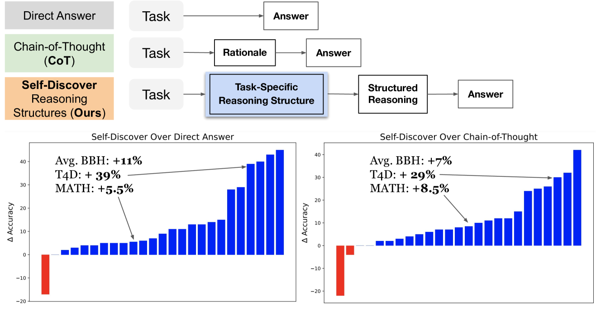

학습을 위한 논문 번역이며, 잘못된 부분에 대한 피드백은 언제나 환영합니다.

**원제: Self-Discover: Large Language Models Self-Compose Reasoning Structures** [post url](https://arxiv.org/html/2402.03620v1)

**저자: Pei Zhou, Jay Pujara, Xiang Ren, Xinyun Chen, Heng-Tze Cheng, Quoc V. Le, Ed H. Chi, Denny Zhou, Swaroop Mishra, Huaixiu Steven Zheng**

______________________________________________________________

### 요약
LLM 이 일반적인 프롬프트 방법에는 어려운 복잡한 추론 문제를 해결하기 위해 task-내재적 추론 구조를 스스로 발견할 수 있는 일반 프레임워크인 SELF-Discover를 소개합니다. 프레임워크의 핵심은 LLM이 비판적 사고 및 단계별 사고와 같은 여러 원자적 추론 모듈을 선택하고 이를 디코딩 중에 LLM이 따를 수 있는 명시적 추론 구조로 구성하는 self discover process 입니다. BigBench-Hard, 기본 agent reasoning, 그리고 MATH 와 같은 까다로운 추론 벤치마크에서 GPT-4 및 PaLM2 의 성능을 Chain of Thought(CoT) 에 비해 최대 32%까지 크게 향상시킵니다. 또한 SELF-DISCOVER는 CoT-Self-Consistency와 같은 추론 집약적 방법보다 20%이상 성능이 뛰어나며 추론 컴퓨팅이 10~40배 더 적게 필요합니다. 마지막으로 우리는 스스로 발견한 추론 구조가 PaLM 2-L에서 GPT-4까지, 그리고 GPT4 에서 Llama2 까지 모든 모델 군에 보편저긍로 적용 가능하고, 인간의 추론 패턴과 공통점을 가진다는 것도 보여줍니다.

그림 1의 경우, llm 스스로 발견하기 위한 추론 구조로 구성하여 어려운 과제를 해결하도록 안내합니다. 제로샷 설정에서 직접 답변보다 우수하고 CoT보다 성능이 우수하다는 것을 발견하였습니다. 전체 결과는 부록C 표 3을 참고하세요

### 1. Self-Discovering Reasoning Structures for Problem-Solving

그림 2: 문제 해결을 위해 자기 발견을 사용하는 그림. 생성 LM, 작업 및 시드 추론 모듈 설명이 주어지면, LM이 작업을 해결하기 위해 키-값 형식의 추론 구조를 생성하도록 안내합니다. 마지막으로 모델은 스스로 발견한 구조를 따라 단계별로 JSON에 값을 입력하여 작업의 모든 인스턴스를 해결할 수 있습니다.

우리는 인간이 사전 지식과 기술을 사용하여 문제를 해결하기 위한 추론 프로그램을 고안하는 방식에서 영감을 얻습니다. 새로운 문제에 직면했을 때, 우리는 종종 이전 경험에서 어떤 지식과 기술이 문제 해결에 도움이 될 수 있는지 내부적으로 먼저 검색합니다. 그런 다음 관련 지식과 기술을 이 과제에 적용하려고 시도합니다. 그리고 마지막으로 문제를 해결하기 위해 여러 가지 개별 기술과 지식을 연결합니다. 그림 2와 같이 이러한 단계를 두 단계로 나누어 셀프 디스커버리를 설계했습니다.

'비판적 사고 사용', '단계별로 생각해 보자'와 같은 높은 수준의 문제 해결 휴리스틱을 나타내는 과제와 일련의 추론 모듈 설명이 주어지면 Self-Discover의 1단계는 메타 추론을 통해 이 과제를 해결하기 위한 내재적 추론 구조를 발견하는 것을 목표로 합니다. 구체적으로는 세 가지 메타 프롬프트를 사용하여 라벨이나 교육 없이도 실행 가능한 추론 구조를 선택, 적용, 구현할 수 있도록 LLM을 안내합니다. JSON을 따르는 것이 추론과 생성 품질을 향상시킨다는 연구 결과와 해석 가능성 때문에 JSON과 유사한 키-값 쌍으로 구조를 형식화했습니다(Zhou et al., 2023; OpenAI, 2023a). 메타 프롬프트와 전체 프롬프트의 구조는 부록에 나와 있습니다. 1단계는 작업 수준에서 작동하므로 각 작업에 대해 한 번만 셀프 디스커버리를 실행하면 됩니다. 그런 다음 2단계에서는 발견된 추론 구조를 사용하여 각 키를 채워 주어진 구조를 따라 최종 답변에 도달하도록 모델에 지시함으로써 주어진 작업의 모든 인스턴스를 간단히 해결할 수 있습니다.

#### 1.1  Stage 1: Self-Discover Task-Specific Structures
첫 번째 단계는 세 가지 작업으로 구성됩니다: 

    1) 추론 모듈 설명 집합에서 과제 해결에 적합한 추론 모듈을 선택하는 선택, 
    2) 선택한 추론 모듈의 설명을 당면한 과제에 더 구체적으로 바꾸어 적용하는 적용, 
    3) 조정된 추론 설명을 구조화된 실행 가능한 계획으로 구현하여 구조를 따라 과제를 

해결할 수 있도록 구현하는 구현으로 구성됩니다.

SELECT

SELF-DISCOVER의 첫번째 단계에서는 task example을 바탕으로 유용한 모듈을 선택하는 모델을 사용 예를들어 critical thinking 비판적 사고는 과학 문제에 대한 제 1 원리이론을 찾는 데 도움이 되고, creative thinking 창의적 사고는 이야기에 대한 새로운 연속성을 생성하는 데 도움이 될 수 있기 때문입니다. 주어진 추론 모듈을 분석할 수 있는 기본 모듈을 가지고 메타 프롬프트를 활용해 self-discover방법에서 과제 해결에 유용한 추론 모듈을 선정합니다. 

ADAPT

SELF-DISCOVER의 다음 단계는 각 모듈을 당면한 과제에 맞게 조정해야 합니다. 만약 '산술 문제'를 접했다면 아래와 같이 변경됩니다.
    기존 추론 모듈 : 현재 문제를 하위 문제로 나누기
    변경된 추론 모듈 : 각 산술 연산을 순서대로 계산하기
작업에 더 적합한 형태로 재구성합니다. 이는 메타 프롬프트를 사용하여 adapted 한 추론 모델 설명을 생성합니다.

IMPLEMENT

변경된 추론 모듈을 활용해서 각 단계별로 생성할 항목에 대한 지침에 대해 작동합니다. 메타 프롬프트 외에도 사람이 작성한 추론구조의 샘플도 제공합니다. 이를 사용해 자연어 설명을 추론하고자 하는 구조로 더 잘 변환하는 또 다른 작업도 제공합니다.

#### 1.2  Stage 2: Tackle Tasks Using Discovered Structures
이러한 세 단계가 끝나면 추론 구조가 구현됩니다. 해결해야 하는 과제에 맞게 조정된 프롬프트를 활용해, 모델이 추론 구조를 따라 답을 생성하도록 유도할 수 있습니다.

### 2. Experiment Setup

#### 2.1 과제

BBH 과제는 저자에 따라 다음 4가지 범주에 걸친 다양한 추론 문제를 다룹니다: 
    1) 알고리즘 및 다단계 산술 추론
    2) 자연어 이해
    3) 세계 지식의 사용
    4) 다국어 지식 및 추론. 
    
또한 모델이 수행해야 할 행동을 결정하기 위해 정신 상태 추론을 활용해야 하는 T4D(Thinking for Doing)라는 근거 기반 소셜 에이전트 추론 과제를 테스트했는데, CoT를 사용한 GPT-4는 약 50%에 불과했습니다. 마지막으로, MATH 테스트 세트에서 200개의 예제를 서브샘플링하고, 원샷 데모를 통해 인스턴스 수준의 추론 구조를 생성하여 수학 작업의 복잡성에 적응하도록 합니다. 평가를 위해 정확도를 사용하여 BBH, T4D 및 MATH에서 모델 성능을 측정합니다(자세한 내용은 부록 B에서 확인할 수 있습니다).

#### 2.2 사용 모델

GPT4, GPT3.5, PaLM2-L, Llama2-70B를 사용하였습니다.

#### 2.3 기준점

다른 제로 샷 프롬프트 방식과 비교하여 LLM 추론에 대해 설명합니다:

- Direct Prompting: 중간 추론 단계 없이 모델이 직접 답을 생성하는 방식
- CoT : 모델이 최종 답변으로 이어지는 추론 과정을 생성하도록 프롬프트를 만들어 답을 생성하는 방식
- Plan-and-Solve : 먼저 계획을 생성한 다음 문제를 해결하라는 메시지가 모델에 표시. Self-Discover은 추론 구조를 atomic reasoning modules에 기반을 두고, 디코딩이 명시적인 키-값 추론 구조를 따르도록 유도한다는 점에서 차이가 있음 

다음으로, 자체 발견에 전달하는 raw seed reasoning modules(RM)을 사용하는 다른 기준점도 고려합니다. 다음 방법의 성능과 작업의 하위 집합에 대한 추론 호출 효율을 비교합니다.

- CoT-Self-Consistency : LLM의 여러 출력을 샘플링하고 답변을 집계하여 최종 답변 얻음. 이 방법은 반복적인 쿼리 비용으로 인해 작업의 하위 집합에 대해 비교 가능
- Majority voting of each RM각 RM의 다수결 투표: 모델에 각 RM을 추가하여 작업을 해결하도록 유도하고 모든 답변의 다수결 투표를 사용하여 최종 답변을 얻음. 여러 RM을 일관된 추론 구조로 통합하는 것이 각 RM을 적용하여 과제를 해결하는 것보다 유리한지 검토하고 추론 계산 비용이 훨씬 더 많이 드는 사후에 다수결 투표를 사용하여 앙상블
- Best of each RM: 이 방법은 오라클 레이블에 액세스할 수 있다고 가정하고 각 RM을 적용했을 때 가장 높은 정확도를 보여줌. 이를 비교하여 셀프 디스커버리가 새로운 작업에 사용할 RM에 대한 완벽한 사전 지식에 의존하는 방법과 경쟁력이 있는지 확인하고자 함.

### 3. Results 

실험 결과를 통해 다음과 같은 질문에 답합니다: 
    1) 추론 구조를 발견하는 것이 LLM 추론 능력을 향상시키는가? (4.1) 
    2) 셀프 디스커버리는 어떤 종류의 문제에서 가장 뛰어난 성능을 보이는가? (4.2) 
    3) Self-Discover가 LLM 성능을 효율적으로 향상시킬 수 있을까? (4.3) 
    4) 마지막으로 자가 발견 구조의 질적 예시와 해당 구조에 따른 LLM 출력, 그리고 다른 추론 유도 방식에 따른 LLM 출력과의 비교(4.4)

#### 3-1. Self-Discover 가 정말 LLM추론 능력을 올려주었을까?

전반적으로 Self-Discover 는 다양한 추론 과제에서 능력을 향상시킵니다. 표 1은 복잡한 추론 과제에서의 결과물을 보여주고 기준점과 비교를 해줍니다.

총 23개의 BBH 과제에서 Self-Discover 과제는 CoT와 Plan-and-solve대비 7%, 6%의 개선효과를 달성하였습니다. 
더 나아가, 전문가가 설계한 ㅊ누론 구조를 사용하는 FaR과 같은 이전 SoTA 프롬프트 방식보다 훨씬 뛰어난 정확도를 달성했습니다. 

#### 3-2. 어떠한 타입의 문제가 가장 효과적이었을까요?

이 방법은 diverse world knowledge가 필요로 한 과제에서 가장 뛰어난 성능을 발휘합니다. 특히 스포츠 이해, 영화 추천, 유적지 이름 확인과 같은 방대한 세계 지식이 필요한 과제에서 효과적이었습니다.

#### 3-3. 얼마나 이 방법이 효과적이었을까요? 

셀프 디스커버리는 자체 일관성 또는 다수결 투표에 비해 추론 컴퓨터가 10~40배 더 적게 필요하면서도 더 나은 성능을 달성합니다. 여기서는 BBH의 두 가지 작업의 하위 집합을 살펴보고 24개 작업 모두에서 실행하기에는 너무 많은 추론 호출이 필요한 작업을 포함하여 보다 철저한 방법 비교를 제시합니다. 그림 5는 GPT-4를 사용하는 각 방법의 인스턴스당 평균 정확도와 필요한 추론 호출 수를 보여줍니다. 정확도(y축)를 보면, 셀프 디스커버리가 CoT 자체 일관성 및 각 RM 적용의 다수결 투표와 같이 반복적인 추론 호출이 필요한 경우에도 다른 기준선보다 뛰어난 성능을 발휘하는 것을 알 수 있습니다. 효율성 측면(x축)에서 보면, Self-Discover는 인스턴스당 한 번의 호출만 필요하고 작업 수준에서는 추론 호출이 세 번 더 필요하며, CoT-자체 일관성은 각 인스턴스마다 10회 샘플링해야 하므로 10배 더 필요하고 각 RM을 사용하는 방법은 40개의 RM을 사용하므로 40배 더 필요합니다. 요약하자면, 자체 발견은 대규모로 배포하기에 효율적인 강력한 추론 부스팅 방법입니다.

#### 3-4. 정성적 예시

그림 6: PaLM 2-L을 사용하여 BBH 과제에서 스스로 발견한 구조의 예. 
'단계별 사고', '작업 성격 반영', 모델이 괄호 구문 분석 작업을 해결하기 위해 스택을 사용하여 알고리즘을 고안하는 흥미로운 창의적 사고 사례와 같은 원자 추론 모듈의 특성을 관찰할 수 있습니다.

CoT와 Plan-and-Solve는 초기에 잘못된 주장을 하고 잘못된 답에 도달하는 반면, Self-Discover의 구조를 따르면 모델이 논리적인 결론("시작 좌표와 끝 좌표가 같으므로 경로가 닫힘")을 도출하고 정답에 도달하는 것을 확인할 수 있습니다.

### 4. Deep Diving into Self-Discovered Reasoning Structures 

그림 7: BBH-기하 도형 과제에서 CoT, 계획 후 해결, 자기 발견을 통해 생성된 추론 과정의 비교. 
CoT와 Plan-and-Solve 모두 경로가 닫힌 경로가 아니므로 규칙적인 도형을 형성하지 않는다고 잘못 판단하여(빨간색으로 강조 표시) 오답에 도달합니다. Self-Discover의 추론 구조(파란색 Courier 글꼴)는 먼저 각 선분을 세분화하고 좌표를 면밀히 분석한 다음 논리적 추론을 활용하여 경로가 같은 좌표에서 끝나므로 닫힌 도형을 형성한다고 결론을 내리고(보라색과 주황색으로 강조 표시), 최종 추론을 통해 정답을 선택하게 됩니다.

먼저 PaLM 2-L 모델을 사용하여 4개의 추론 과제에 대한 추론 구조를 발견합니다. 그런 다음 결과 추론 구조를 GPT-4의 디코딩에 접지로 적용합니다. 최적화를 통해 제로 샷 프롬프트를 발견한 OPRO(Yang et al., 2023)와 우리의 접근 방식을 비교합니다. 각 작업에서 PaLM 2-L을 사용하여 최적화된 OPRO 프롬프트를 동일한 추론 작업의 GPT-4에 적용합니다. 그림 9는 OPRO가 프롬프트를 최적화하는 데 20%의 데이터를 사용했음에도 불구하고 4개 작업 중 3개 작업에서 Self-Discover가 OPRO보다 우수한 성능을 보였음을 보여줍니다. 이와 대조적으로, Self-Discover는 제로 샷 방식으로 수행되어 우리 방법의 효율성과 발견한 추론 구조의 보편성을 보여줍니다.

#### 4-1. GPT-4에서 발견한 구조를 라마2와 ChatGPT에 적용하기

LLM 간의 전이성 성능에 자극을 받아, 저희는 LLM에서 자체적으로 발견한 추론 구조가 구조 자체를 생각해내기 어려운 소규모 LM의 추론을 향상시킬 수 있는지 추가로 조사했습니다3. 저희는 GPT-4를 사용하여 작업 내재적 추론 구조를 발견한 다음, 이러한 구조를 오픈 소스 Llama2-70B의 디코딩과 BBH의 두 가지 작업 하위 집합에 대한 GPT-3.5-turbo(ChatGPT)에 적용했습니다. 그 결과, Llama2에서 자체적으로 발견한 구조를 사용하는 경우(52%)가 모호성 QA 제로 샷에서 CoT(42%)보다 성능이 뛰어나고, GPT-3.5-turbo에서 구조적 추론 프로세스에서 3샷 데모를 사용하는 지오메트리에서 CoT(51%)보다 성능이 뛰어나다는 것을 발견했습니다.

### 5. Conclusion

모델이 일반적인 문제 해결 능력의 씨앗 세트에서 모든 작업에 대한 추론 구조를 스스로 발견할 수 있는 효율적이고 성능이 뛰어난 프레임워크인 Self-Discover를 소개합니다. 여러 LLM의 까다로운 추론 벤치마크에서 최대 30%까지 대폭 개선된 결과를 관찰했습니다. 셀프 디스커버리에 대한 Ablations의 연구는 구성된 추론 구조가 LLM 간에 보편적으로 이전 가능하다는 것을 보여줍니다. 

